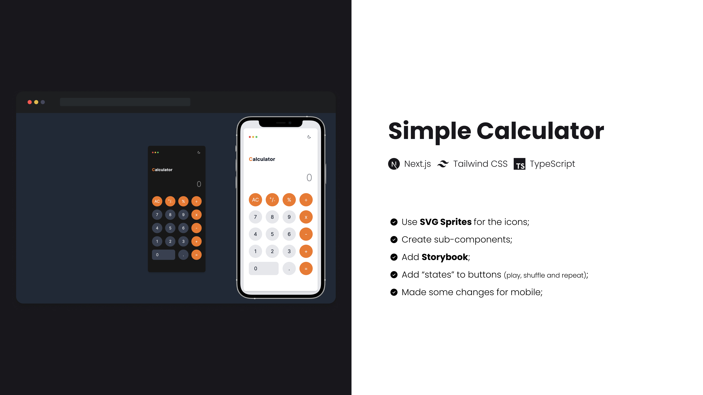

# Simple Calculator

This repo contains a simple calculator done using

[![udemy][udemy]][course]

## 🛠 Skills

![nextjs][nextjs] ![tailwindcss][tailwindcss] ![typescript][typescript]

## 📄 Roadmap

- [x] Use **Next.js** with `app/` directory;
- [x] Use **Tailwind CSS** for styling;
- [x] Implement dark and light mode;
- [x] Use `eval()` to calculate the string (instead of made conditions for every operator);
- [x] Add **ESLint** config.;
- [x] Add **Prettier** config.;
- [x] Add **commitlint**;
- [x] Add **Husky** and **LintStaged** to add commit hooks.

## 🔗 More About Me

[nextjs]: https://img.shields.io/badge/nextjs-1C1C1F?style=for-the-badge&logo=next.js&logoColor=white
[tailwindcss]: https://img.shields.io/badge/tailwindcss-1C1C1F?style=for-the-badge&logo=tailwindcss&logoColor=white
[typescript]: https://img.shields.io/badge/typescript-1C1C1F?style=for-the-badge&logo=typescript&logoColor=white
[udemy]: https://img.shields.io/badge/Udemy%20-%23EA5252.svg?&style=for-the-badge&logo=Udemy&logoColor=white
[course]: https://www.udemy.com/course/build-a-calculator-in-react-javascript-foundations/
